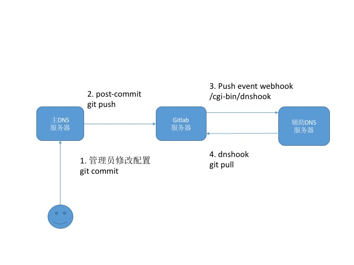

## [原创] git辅助DNS服务器的运行

本文原创：**中国科学技术大学 张焕杰**

修改时间：2018.06.21

DNS服务器一般有若干台，这些服务器间需要数据同步。

传统的方式使用zone transfer，其中一台DNS服务器做为主服务器，其他服务器作为从服务器。
从服务器定时查询主服务器的zone文件SOA处的序列号，一旦发现序列号比自己的大，就是用zone transfer协议获取最近的zone文件。

我们使用git来做这些同步，相比之下优点如下：

* 使用多种hook机制，可以做到主DNS服务器文件变更后，立即触发其他服务器更新配置，并重启bind进程，立即生效
* 每个服务器上均保留有所有变更记录，任何服务器损坏都不会丢失配置

具体做法如下：

首先有套可以工作的git，我们是自己建立的gitlab ce服务器。



## 一、主DNS服务器

1.1 设置`pre-commit` hook，只有一条命令，用于检查配置是否正确，只有正确的配置，才会允许commit
```
#!/bin/sh
/sbin/service named configtest
```

1.2 设置`post-commit` hook，用于重启自己的bind进程，并push到 git 服务器

```
#!/bin/sh
/sbin/service named restart

git push origin master
```

## 二、git server

我们使用的是gitlab ce，在DNS项目的Settings/Integrations中对每个辅助DNS服务器增加一个WEB hook，触发条件是
`Push events`，URL是 http://x.x.x.x/cgi-bin/dnshook，其中x.x.x.x是每个辅助DNS服务器的IP地址。

## 三、辅助DNS服务器

3.1 webook的cgi程序

`vi dnshook.c`，内容如下(假定named配置文件在/named目录下)：
```
#include <stdio.h>
#include <stdlib.h>

void main()
{
        setuid(0);
        system("cd /named; git pull");
}
```
执行如下命令，编译并放到www服务器目录下：
```
gcc -o dnshook dnshook.c
cp dnshook /var/www/cgi-bin
chmod u+s /var/www/cgi-bin/dnshook
```

3.2 设置`post-merge`和`post-update` hook，内容相同，均为如下：
```
#!/bin/sh

/sbin/service named configtest 
if [ $? = 0 ] ; then
	killall -9 named
 	/sbin/service named start
fi
```

***
欢迎 [加入我们整理资料](https://github.com/bg6cq/ITTS)
