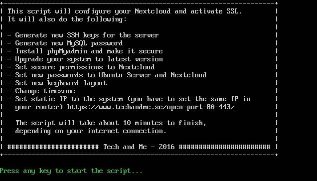

## [原创]使用Nextcloud提供私有网盘服务

本文原创：**南京审计大学 吴鑫**

修改时间：2017.10.10

## 一、Why Nextcloud？

###1、为什么是Nextcloud?
假设你想在校内搭建一个私有云盘服务，并且有以下的需求，那么`Nextcloud`，简称`NC`是你的不二之选
- 没有资金的投入，但是有相应的需求；
- 需要部署在私有云上；
- 有多客户端要求（iOS、Android、MAC、Windows）
- 安全可靠，长期更新
- 有和现有系统（例如`LDAP`集成需求）
- 良好的插件支持，全中文界面

###2、NC能做什么？
- 将您设备（包括PC、MAC、智能手机）上的文件同步到云空间，并在任意时间、地点，通过任意设备访问；
- 可以使用浏览器，或者客户端、手机APP访问；
- 支持文件版本，不管误删除还是中毒，都可以恢复到以前的版本；
- 在线预览文本、Office文件、图片，无需下载，部分文件可以直接在网页中编辑；
- 收取别人提交的文件，例如交作业。具体使用方式可以参考：点击查看动图
- 建立部门工作档案库，文件版本保持同步，A用户编辑的文档，保存后自动上传到服务器，B用户自动下载最新版本；
- 和其他用户进行协同工作。例如：课题组、社团、项目组，甚至某个会议的与会人员。您只要建立一个共享组，通过学、工号将所有用户加入进来，他们就可以共享对应的文件。
- 将文档公开共享给别的用户。将共享连接发送给别人。共享可以设置加密、过期时间等。例如：需要将您的课件共享给您的学生。
- 私密共享给别的用户随时通过学工号将文件分享给任意校内用户；

###3、和其他系统区别？
其他常见的网盘系统包括`seafile`、`owncloud`等。为什么我选择了`nc`?
- 我有`ldap`集成需求，`seafile`只有收费版才支持
- `nextcloud`实际上就是`owncloud`创始人出来做的一个产品，至少目前很多插件都是可以通用的。个人更看好`nextcloud`


## 二、环境准备
在开始之前，请确定你已经准备好以下条件：
- `VMWare`环境的虚拟机（本文以VMWare为例，其他也可以）
- 一定的存储空间
- 数据中心有一台`DHCP`服务器，服务器可以上网
- 一定的`Ubuntu`基础知识
- **一颗不怕折腾的心，一个支持你工作的领导**

##三、安装
- 到`NC`官网，选择`20G`的镜像并下载，地址：`https://www.techandme.se/nextcloud-vm/`，可以多测几次，我使用的是澳大利亚镜像。相对较快。
- 压缩包中为`VMDK`文件，请使用`VMWare vCenter Converter`转换。具体使用方法本文跳过。
- 转换完成后，启动，默认账号为`ncadmin`，密码为`nextcloud`
- 随后检测网络，注意网络需要`提前准备好`DHCP才行。配置过程里会让你设置静态IP。
- 安装过程会通过ping网关来确定网络是否可达。请确保网关可ping。
- 然后他会自己找镜像，等一会就行了。
- 需要注意的是，如果没有DHCP，这个OVF似乎无法判断你所在的位置，默认的键位就是瑞典的，`/`会变成`-`，需要使用`sudo dpkg-reconfigure keyboard-configuration`命令重新配置键盘

安装脚本的主要工作如下：



##四、使用
使用网址登录你的服务器即可使用。默认管理员为`ncadmin`，密码`nextcloud`
本文主要面向系统管理员，因此使用说明略过。


##四、其他系统管理常见问题
###关于扩容
我们使用的镜像，默认只有20G，1TB和500g的要收费才行。当然，也可以自己操作。
具体步骤如下（请自行做好备份）
- 关机，做一个备份（快照）
- 编辑磁盘空间为1.5T。
- 开机
- `sudo -i`
- `echo "- - -" > /sys/class/scsi_host/host0/scan`，扫描
- `cfdisk /dev/sda`，
- cfdisk创建分区（移动到`new`）
- 选择Logic，Type选择Linux8E(LVM)，最后write
- 扫描，`partprobe -s`
- 看看当前是是sda几，`fdisk -l`
- 格式化：`mkfs.ext4 /dev/sda6`
- `pvcreate /dev/sda6`，创建pv
- `vgextend nextcloud-vg /dev/sda6`，扩展vg
- `lvextend -L+XXG /dev/nextcloud-vg/root`，扩展lv
- `resize2fs /dev/nextcloud-vg/root`
- `sudo reboot`
- `df -h`

###默认配额
- 默认配额可以设置，点击用户
- 左下角有个齿轮
- 有默认配额设置

###默认文件
- 每个账户新建之后都会有一个默认文件
- 这个文件在`/var/www/nextcloud/core/skeleton`下
- 可以自己编辑，例如放进去你的说明文档
- 上传新文件`不会`影响已经建立的用户

###通知
- 对于支持通知的浏览器（Chrome/Firefox），打开之后就会收到通知信息了


###修改客户端下载地址
默认NC的客户端都需要到国外下载，显然太慢了。
可以事先将客户端下载好，并用自己的账号在`nc`中分享。
参考：
`https://docs.nextcloud.com/server/11/admin_manual/configuration_server/custom_client_repos.html`

打开`NC`的`config.php`中，增加：
```
  "customclient_desktop" => "https://yun.nau.edu.cn/s/uY0mAhtcGPelMNx",
  "customclient_android" => "https://yun.nau.edu.cn/s/J01ipMIqNyPrgQd",
  "customclient_ios"     => "https://itunes.apple.com/us/app/nextcloud/id1125420102?mt=8",
  "customclient_mac"     => "https://yun.nau.edu.cn/s/5z52GmGFDAtasJa"
```

#六、使用技巧

- txt等文件，是可以在线编辑的，编辑完，使用`Ctrl+S`就可以保存，很方便是不是？
- 对于现代浏览器（Firefox/Chrome等），可以在浏览器中直接拖动，例如将文件拖动到文件夹中
- 试着双击视频文件，看看有什么效果？（预览）
- 支持版本功能。例如txt文件，当你编辑过之后发现后悔了，点击文件旁边的详细-版本，就可以看到以前编辑的版本并及时恢复

