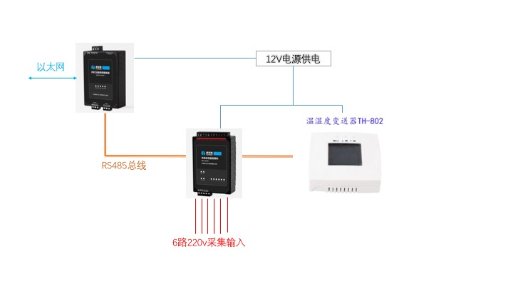

## [原创] 通过RS485总线使用Modbus RTU over TCP 协议采集环境传感器信息

本文原创：**中国科学技术大学 张焕杰**

修改时间：2018.01.21

本文记录一个RS485总线上的供电状态和温湿度传感器信息采集程序的开发过程。

## 一、系统中的设备

系统中有一个网口转RS485的转换器([taobao链接](https://detail.tmall.com/item.htm?id=520676764679))，转换器的RS485总线上连接了2个传感器，分别是
6路市电交流供电状态传感器([taobao链接](https://item.taobao.com/item.htm?id=524649936848))和温湿度传感器(10多年前购买的，型号为TH-802)。



## 二、设备参数和命令格式

网口转RS 485的转换器IP地址是202.38.64.142，工作于TCP-SERVER模式，TCP端口是8000。

6路市电状态传感器485总线地址是1，以命令3（读取保持寄存器）从寄存器地址40400开始读6个16bit数，是6路市电的状态，1表示有电(220v左右)，0表示无电(低于100v)。

温湿度传感器([协议文档](https://wenku.baidu.com/view/b9211a3d67ec102de2bd8980.html))485总线地址是2，以命令4（读取输入寄存器）从寄存器地址0开始读2个16bit数，当作带符号16bit整数，除以10以后，分别是温度和湿度。

返回的16bit整数，第1个字节是高位，第2个字节是低位，与通常的x86不同，需要转换一下，libmodbus会完成转换。

## 三、libmodbus 库安装

本文使用libmodbus库来处理底层通信。

需要说明的是，上面的网络转RS485转换器，是直接利用TCP传输modbus rtu数据包(通常称为RTU over TCP)，这种协议并不是modbus-tcp，
原作者 https://github.com/stephane/libmodbus 中并不支持这种方式。

https://github.com/v-zhuravlev/libzbxmodbus 做了修改，支持RTU over TCP，我把两者结合放在 https://github.com/bg6cq/libmodbus-rtutcp

```
cd /usr/src/
git clone https://github.com/bg6cq/libmodbus-rtutcp.git
cd libmodbus-rtutcp
./configure
make install
cp /usr/local/lib/libmodbus.so.5 /lib
```

## 四、简单的采集程序

程序逻辑很简单，每秒钟采集一次，采集的数据保存在文件中：

程序文件放在目录 /usr/src/powermon 下

Makefile
```
all: read485

read485: read485.c
        gcc -g -o read485 read485.c -L/usr/local/lib -lmodbus
```

read485.c，读入L1-L6的状态，分别写入文件L1-L6；读入温度和湿度信息，分别写入文件Utemp和Uhum；把最后的更新时间写入文件Ulast。

```
#include <stdio.h>
#include <stdlib.h>
#include <unistd.h>
#include <time.h>
#include <sys/types.h>
#include <assert.h>
#include <ctype.h>
#include <signal.h>
#include <errno.h>

#include "/usr/local/include/modbus/modbus.h"

#define DEBUG 1

#define MAXLEN 16384

void Process(char *server, char * port) 
{       modbus_t *mb;   
        uint8_t buf[MAXLEN];
        char fname[MAXLEN];
        FILE *fp;
        int n,i;
        short int v;
        struct timeval tv;
        mb = modbus_new_rtutcp(server, atoi(port));
        tv.tv_sec = 2;
        tv.tv_usec = 0;
        modbus_set_response_timeout(mb, &tv);
        if (modbus_connect(mb) == -1) {
#ifdef DEBUG
                fprintf(stderr, "Connection failed: %s\n", modbus_strerror(errno));
#endif
                abort();
        }

        while (1) {
// read L1-L6 status
                modbus_set_slave(mb, 1);
                if(6!=modbus_read_registers(mb, 40400, 6, buf)) {
#ifdef DEBUG
                        printf("read L1-L6 registers failed: %s\n", modbus_strerror(errno));
#endif
                        abort();
                }
#ifdef DEBUG
                printf("L1-L6 status: ");
                for(i=0;i<6;i++) 
                        printf("L%d=%d ",i+1, *(short int*)(buf+i*2));
                printf("\n");
#endif
                for(i=0;i<6;i++) {
                        sprintf(fname,"UL%d",i+1);
                        fp=fopen(fname,"r+");
                        if(fp) {
                                fseek(fp,0L,SEEK_SET);
                                if(1 == *(short int*)(buf+i*2))
                                        fprintf(fp,"1");
                                else
                                        fprintf(fp,"0");
                                fclose(fp);
                        }
                }

//read temp & hum
                modbus_set_slave(mb, 2);
                if(modbus_read_input_registers(mb, 0, 2, buf)!=2) {
#ifdef DEBUG
                        printf("read temp/hum registers failed: %s\n", modbus_strerror(errno));
#endif
                        abort();
                }
                v = *(short int*)(buf);
#ifdef DEBUG
                printf("Temp=%d ",v);
#endif
                fp=fopen("Utemp","r+");
                if(fp) {
                        fseek(fp,0L,SEEK_SET);
                        fprintf(fp,"%6.2f",v/10.0);
                        fclose(fp);
                }
                v = *(short int*)(buf+2);
#ifdef DEBUG
                printf("Hum=%d\n ",v);
#endif
                fp=fopen("Uhum","r+");
                if(fp) {
                        fseek(fp,0L,SEEK_SET);
                        fprintf(fp,"%5.2f",v/10.0);
                        fclose(fp);
                }

                fp=fopen("Ulastrun","r+");
                if(fp) {
                        fseek(fp,0L,SEEK_SET);
                        fprintf(fp,"%ld",time(NULL));
                        fclose(fp);
                }
                sleep(1);
        }
}


void usage()
{
        printf("read485 v1.0 by james@ustc.edu.cn\n");
        printf("read485 [ x.x.x.x port ]\n\n");
        exit(0);
}

int main(int argc, char *argv[])
{
        char *server="202.38.64.142";
        char *port = "8000";
        signal(SIGCHLD,SIG_IGN);
        if(argc==3) {
                server=argv[1];
                port = argv[2];
        } else if(argc!=1) {
                usage();
                exit(0);
        }

#ifndef DEBUG
        daemon_init("read485",LOG_DAEMON);
        while(1) {
                int pid;
                pid=fork();
                if(pid==0) // i am child, will do the job
                        break;
                else if(pid==-1) // error
                        exit(0);
                else
                        wait(NULL); // i am parent, wait for child
                sleep(2);  // if child exit, wait 2 second, and rerun
        }
#endif
        Process(server, port);
        return(0);
}
```

执行`make`编译程序后，`./read485`可以看到能读出相关信息。


## 五、简单的WEB显示程序

下面是非常简单的index.php，用来显示采集到的状态。

显示的例子请参见 [http://netfee.ustc.edu.cn/powermon/](http://netfee.ustc.edu.cn/powermon/)

```
<?php
header("refresh: 20;");
?>
<meta name="viewport" content="initial-scale=1"><meta name="viewport" content="width=device-width">
<p>UPS房间<br>
<?php
$tm = file_get_contents("/usr/src/powermon/Ulastrun");
echo date("Y-m-d H:i:s",$tm);
echo "<br>";
if(time()-$tm>5) echo "<font color=red>数据更新不及时</font><br>";
readfile ("/usr/src/powermon/Utemp");
echo "°C ";
readfile ("/usr/src/powermon/Uhum");
echo "%<br>";
echo "<table border=1 cellspacing=0>\n";
echo "<tr><td>&nbsp;</td><td>主用</td><td>备用</td></tr>\n";
echo "<tr height=44><td>电源</td><td width=44></td><td width=44></td><tr>\n";
echo "<tr height=44><td>开关</td><td width=44></td><td width=44></td><tr>\n";
echo "<tr height=44><td>过流</td><td width=44></td><td width=44></td><tr>\n";
echo "</table>";
?>
```


***
欢迎 [加入我们整理资料](https://github.com/bg6cq/ITTS)
